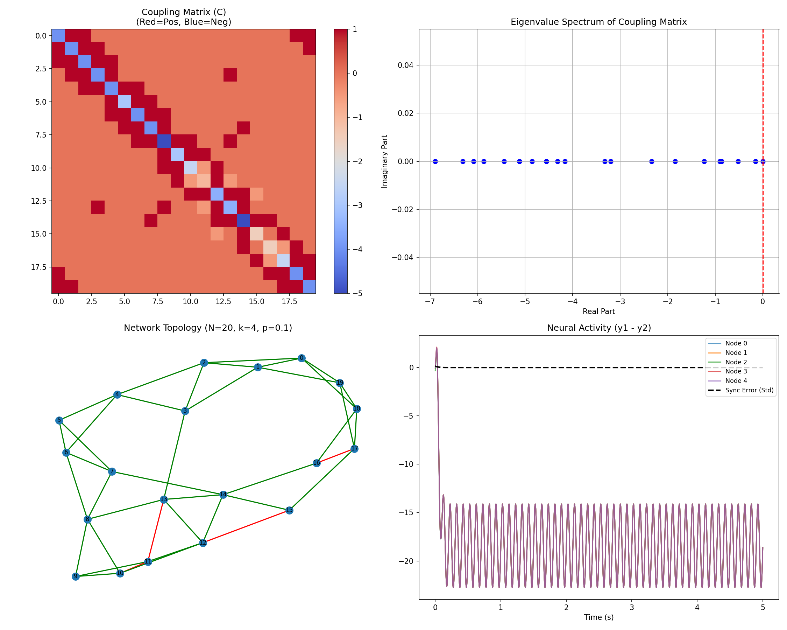
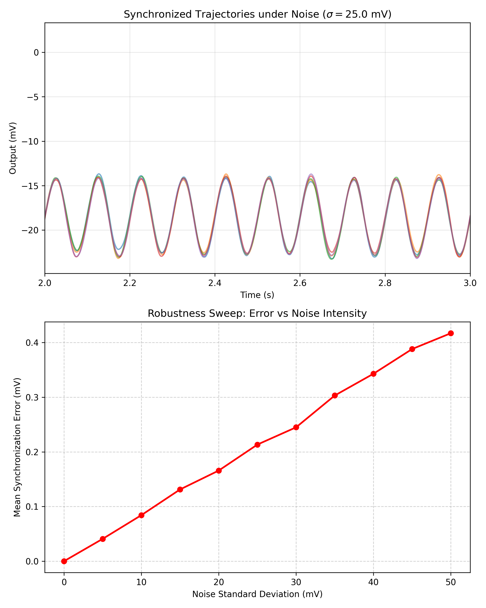

# Spectral Stability & Synchronization in Mixed-Sign Neural Networks

[](https://www.python.org/)
[](https://scipy.org/)
[](https://opensource.org/licenses/MIT)
[](https://github.com/zapata131/simulation-chaotic-systems-negative-couplings)

> **Simulating the emergence of synchronization in complex networks with inhibitory (negative) interactions.**

This repository explores the counter-intuitive phenomenon where networks can achieve global synchronization even in the presence of antagonisms, competition, or inhibition. Originally demonstrating this effect in chaotic **Lorenz oscillators**, we have extended the framework to **Biological Neural Mass Models**, simulating how inhibitory synaptic connections contribute to brain network dynamics.


*Figure 1: Synchronization of a Jensen-Rit neural network with 10% inhibitory connections.*

## 🧠 Biological Modelling: Neural Mass Networks

This project applies the "negative coupling" concept to the study of cortical networks, where **inhibitory interneurons** are essential for regulating activity. We utilize the **Jansen-Rit Neural Mass Model** to simulate cortical columns, exploring how inhibition "sculpts" global dynamics.

### Key Capabilities
- **Cortical Column Simulation**: High-fidelity implementation of the Jansen-Rit ODEs (Pyramidal, Excitatory, Inhibitory populations).
- **Mixed-Sign Topology**: Simulates realistic networks with both excitatory and inhibitory synaptic connections ($A_{ij} < 0$).
- **Spectral Stability**: Algorithms to generate Small-World topologies that satisfy the **Relaxed Spectral Stability Condition**, ensuring coherence even in competitive networks.
- **Robust Synchronization**: Visual proof that networks can achieve perfect synchronization (Zero Error) despite significant inhibitory feedback.

### Run the Simulation
```bash
python3 jansen_rit_network.py
```
*Output: Generates `jansen_rit_simulation.png` visualizing the coupling matrix spectrum, network topology, and neural activity.*

### Research Insights

Our simulations reveal a critical mechanism for biological networks: **Inhibition does not preclude synchronization; it structures it.**

- **Binding by Inhibition**: Contrary to the intuition that inhibition segregates activity, our results show that **inhibitory interneurons can actively bind functional assemblies**. By "sculpting" the network's eigenspectrum, inhibition defines the boundaries of the synchronization manifold.
- **Robustness**: The system demonstrates remarkable robustness, maintaining global gamma-band coherence even with significant fractions of inhibitory connections (e.g., 10%), provided the global topology remains spectrally stable.
- **Clinical Relevance**:
    - **Epilepsy**: Suggests that hypersynchronization (seizures) can occur *even in the presence of strong inhibition* if the network's spectral properties become pathological.
    - **Cognition**: Supports the "Binding by Synchrony" hypothesis, showing how flexible cognitive processing can emerge from fixed, mixed-sign anatomical connectivity.

> **Read the full paper**: The complete scientific paper, including mathematical proofs and extensive citations, is available in the `paper/` directory.

---

## 🌪️ Foundational Theory: Chaotic Lorenz Systems

This work is built upon the theoretical findings of **Solís-Perales & Zapata (2013)**, which challenged the traditional assumption that cooperative (positive) links are necessary for synchronization.

### The Relaxed Stability Condition
Classical network theory often requires non-negative off-diagonal elements in the Laplacian. We show that this is **not necessary**. The critical requirement is that the **eigenvalues of the coupling matrix** remain in the stable region of the Master Stability Function.

$$ \dot{\mathbf{x}}_i = \mathbf{f}(\mathbf{x}_i) + C \sum_{j=1}^{N} A_{ij} (\mathbf{x}_j - \mathbf{x}_i) $$

We validate this using a network of **Lorenz Oscillators**, where $A_{ij}$ can be negative.

### Run the Chaotic Simulation
```bash
# Verify the foundational theory with Lorenz oscillators
python3 lorenz_network.py
```

### Analysis: Statistical Robustness
We provide a standalone tool to quantify how rare stable configurations are. This script runs a Monte Carlo simulation to estimate the probability of finding a spectrally stable network as the fraction of inhibitory edges increases.

```bash
# Run the robustness analysis
python3 probability_stability.py
```
*Output: Generates `probability_stability.png`, plotting the likelihood of stability vs. inhibition percentage.*

### Analysis: Noise Robustness
We also verify that synchronization survives in the presence of biologically realistic noise (Additive White Gaussian Noise).

```bash
# Run the noise robustness check
python3 paper/generate_noise_figure.py
```
*Output: Generates `figure_5_noise.png`, showing synchronization error vs noise intensity.*



## 🔑 Stability Criteria for Synchronization

The core contribution of this work is defining *when* a network with negative couplings can synchronize.

### Standard Condition (Traditional)
Standard network theory typically requires **cooperative interactions**:
$$ A_{ij} \ge 0 \quad \forall i \neq j $$
This ensures the coupling matrix has the properties of a standard Laplacian (M-matrix), guaranteeing stability if the coupling strength is sufficient.

### Relaxed Condition (Our Method)
We demonstrate that non-negativity is **not necessary**. Synchronization is preserved if the **Spectral Stability Condition** is met:

> **Condition**: The eigenvalues $\lambda_k$ of the coupling matrix $\mathcal{C}$ must lie within the stability region of the Master Stability Function (MSF) for the dynamical system.
>
> $$ \text{Re}(\lambda_k) < 0 \quad \text{for } k=2 \dots N $$

In practice, this means we can have negative links ($A_{ij} < 0$) as long as the "net" connectivity remains diffusive and stable. For Lorenz and Jansen-Rit systems, this often implies that the second largest eigenvalue $\tilde{\lambda}_2$ must satisfy:
$$ |\tilde{\lambda}_2| \ge |\bar{d}| $$
Where $\bar{d}$ is the maximum Lyapunov exponent (divergence) of the isolated node dynamics.

## 💻 Installation

1.  **Clone the repository**:
    ```bash
    git clone https://github.com/zapata131/simulation-chaotic-systems-negative-couplings.git
    cd simulation-chaotic-systems-negative-couplings
    ```

2.  **Install scientific dependencies**:
    ```bash
    pip install -r requirements.txt
    ```


## 📚 References

> **G. Solís-Perales and J. L. Zapata**, "Synchronization of Complex Networks with Negative Couplings," *2013 International Conference on Physics and Control (PHYSCON 2013)*, San Luis Potosí, Mexico, Aug. 2013.

---
*Maintained by [Zapata131](https://github.com/zapata131)*